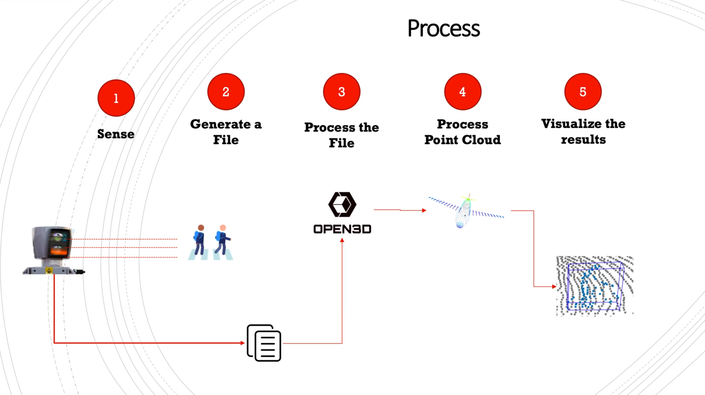

# Pointcloud Refresher Repo

## Introduction

This repository can be referenced as a referesher or as an introduction to LiDARs and Point Clouds. 
It's a super-hot topic nowadays, and I hope I'll do a great job in helping you understand how learning about 3D can impact one's career. 

Here we will learn:

* What is a LiDAR
* How to process points in 3D coming from LiDAR Sensors
* How to speed up processing using a Voxel Grid
* How to do freespace detection in 3D using RANSAC algorithm
* Unsupervised Learning Overview and different clustering techniques to use to detect obstacles
* Bounding Box detection in 3D

Between each step of the detection process, we will implement a part using Open3D, a library for point cloud processing. Knowing Python language is the only requirement to follow the course. 

## Overall Process

The E2E process for the project we will be working on would be:

* **Sense:** Sense the world suing ToF sensor like LiDAR to reflect from the obstacles in the real-world and register information back to the sensor. 
* **Generate a file:** Pre-process, consolidate, and save the scan as a single file.
* **Process the file & Point Cloud:** Use Open3D (or alternatively PCL) for loading the pointcloud scans and processing it.
* **Visualize the results:** Using visualizers like Matplotlib or Plotly visualize the pointclouds.